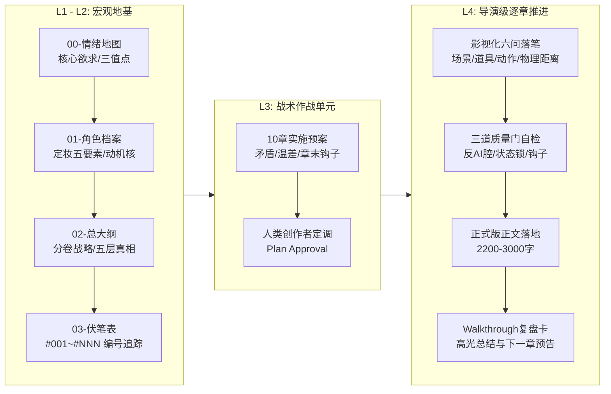

# 商业写作系统 | Commercial Writing System (CWS)

<p align="center">
  <strong>专为中长篇连载小说、高能短剧与爆款网文打造的工业化专业创作引擎</strong>
</p>

<p align="center">
  
  
  
  
  
  
</p>

---

## 📖 为什么需要「商业写作系统」？

直接让大语言模型（LLM）写长篇小说，99% 会在 3~5 万字之内迅速崩坏，陷入 AI 写作的**四大绝症**：

| 绝症症状 | 产生原因 | 商业写作系统的破局解法 |
| :--- | :--- | :--- |
| **悬浮虚假（假大空）** | 缺乏具象感官，充斥“极其、极度、宛如、不禁”等廉价副词与心理概括 | **影视化写作宪法**：场景三问（光/空间/气味）、道具重量质感、微动作特写 |
| **机械降神（战力失控）** | 模型缺乏物理约束，遇到难关就强行神级自愈或天降奇兵 | **活体状态快照**：伤情物理锁定（骨折必须瘸行30章）、资源实打实对账 |
| **失控烂尾（前写后忘）** | 上下文窗口滑动导致重要人物蒸发、伏笔无序悬空 | **伏笔四态生命周期**：全书伏笔强制编号（#001~#NNN），50章必须闭环对账 |
| **黑盒跳步（快餐粗糙）** | 一次性指令生成万字粗坯，文笔注水、节奏崩塌 | **四级阶梯骨架**：10章一个战术单元，实施预案先行，一章一磨，质量门卡点 |

---

## 🏛️ 系统核心架构（Architecture）

商业写作系统将顶级职业写手的创作直觉，解构成一套**确定性、可量化、可工程化复现的工业流水线**：



---

## 📂 仓库目录结构

```text
commercial-writing-system/
├── SKILL.md                                # 核心技能入口（遵循 Agentic Skill 规范）
├── README.md                               # 本项目说明书
├── LICENSE                                 # MIT 开源协议
├── references/                             # 核心方法论与权威规范
│   ├── cinematographic-constitution.md     # 影视化写作宪法（场景三问、道具质感、慢动作）
│   ├── anti-ai-lexicon.md                  # 反AI腔词汇黑名单与置换指南（永久封杀“极其/宛如”）
│   ├── foreshadowing-tracker-spec.md       # 伏笔生命周期模型与活体状态追踪对账
│   └── genre-playbooks.md                  # 主流赛道节拍手册（男频权谋/女频古言/知乎反转/微短剧）
└── templates/                              # 开书工程脚手架模板
    ├── 00-emotion-map.md                   # 情绪地图模板
    ├── 01-character-profile.md             # 活体角色档案表模板
    ├── 02-master-outline.md                # 四级骨架大纲模板（含五层真相法）
    ├── 03-unit-plan-10ch.md                # 10章单元战术实施预案模板
    └── 04-chapter-walkthrough.md           # 单章复盘与交付卡模板
```

---

## 🚀 快速上手（Quick Start）

### 方式一：在任何 skills-compatible runtime 中安装（Claude Code / Codex / Cursor / Hermes / OpenCode / Antigravity 等 50+ 通用）

#### ① 一键 auto-detect（推荐）

大多数 skills-aware runtime 会自动发现 `~/.skills/` 下的项目：

```bash
git clone https://github.com/your-org/commercial-writing-system.git ~/.skills/commercial-writing-system
```

#### ② 各 runtime 手动路径表

| Runtime | Skill 安装路径 |
|---|---|
| Claude Code | `~/.claude/skills/commercial-writing-system/` |
| Codex | `~/.codex/skills/commercial-writing-system/` |
| Cursor | `~/.cursor/skills/commercial-writing-system/` |
| Antigravity / Gemini CLI | `~/.gemini/config/skills/commercial-writing-system/` |
| Hermes / CodeBuddy / OpenCode / 其他 | 参考各 runtime 的 skills 文档 |

```bash
# 例：Claude Code 用户
mkdir -p ~/.claude/skills && cd ~/.claude/skills
git clone https://github.com/your-org/commercial-writing-system.git
```

#### ③ 作为参考资料 cat 进 context（无 skill 机制的 fallback）

如果你的 runtime 没有 skill 加载机制，把整份规范丢进 LLM 的 system prompt：

```bash
cat SKILL.md references/*.md  # 一次性喂入当前会话
```

安装完成后，在对话中对 Agent 发送指令即可激活：
> “使用**商业写作系统**，帮我开一本200章的历史权谋小说，核心设定是……”

### 方式二：手动集成到任意小说项目

1. 在你的小说项目根目录下，新建 `设定/` 文件夹。
2. 将 `templates/` 下的文件复制到 `设定/` 中作为开书底盘：
   - `设定/00-情绪地图.md`
   - `设定/01-角色档案.md`
   - `设定/02-大纲.md`
   - `设定/03-伏笔追踪表.md`
3. 按照 `templates/03-unit-plan-10ch.md` 规划第一个 10 章单元。
4. 动笔时让 AI 严格读取 `references/cinematographic-constitution.md` 与 `references/anti-ai-lexicon.md`。

---

## 🎯 效果对比：原生 AI vs 商业写作系统

| 场景 | 原生大模型直接生成（AI腔拉满） | 商业写作系统驱动（影视级质感） |
| :--- | :--- | :--- |
| **刑场救人** | “他心中极度震惊，宛如晴天霹雳。面对凶恶的敌人，他毫不犹豫地拔出了锋利的宝剑，心中充满了滔天的愤怒，誓要拯救眼前的女子。” | “一缕惨白的日光顺着闸刀的青刃斜劈下来。他下颌咬肌猛地一突，右手拇指顶开簧锁，‘铮’的一声脆响，百炼折叠锻打的花纹钢出鞘三寸，激起一股冰冷的铁腥。” |
| **伤后战斗** | “虽然他身负重伤，但他凭借顽强的意志力，再次施展出排山倒海的绝招，杀得敌人落荒而逃。” | “他左腿夹板崩断，断骨在肌肉里发出令人牙酸的摩擦声。他没有后退，右臂单手倒提百斤斩马刀，借着战马俯冲的惯性，自上而下一记暴烈的硬砸！” |
| **两军对峙** | “两支大军阵容浩大，杀气腾腾，战争一触即发。” | “五万张强弓硬弩在阳光下汇成一片反光的银色海洋。四下静得连黄沙落在枯叶上的沙沙声都听得一清二楚，只有战旗在腥风里被抽打得啪啪作响。” |

---

## 🛠️ 三道质量门自检体系

每一章输出后，系统内置了严苛的质量门验收：

- **第一门：语言去油门** —— 扫描全文，严查“极其、极度、宛如、简直、仿佛、赫然、不禁、不仅……更是……”，不达标自动退回重修。
- **第二门：物理连续门** —— 伤情是否有物理限制？随身干粮与水囊数量是否闭环？衣着泥垢是否符合当前天气？
- **第三门：末行悬念门** —— 最后五行是否具备强钩子？拒绝平淡收束，必须让读者本能想翻开下一章。

---

## 📄 开源许可证

本项目基于 [MIT License](LICENSE) 开源。欢迎所有网络作家、编剧、独立游戏开发者及 AI 创作者自由使用、魔改与分发。
