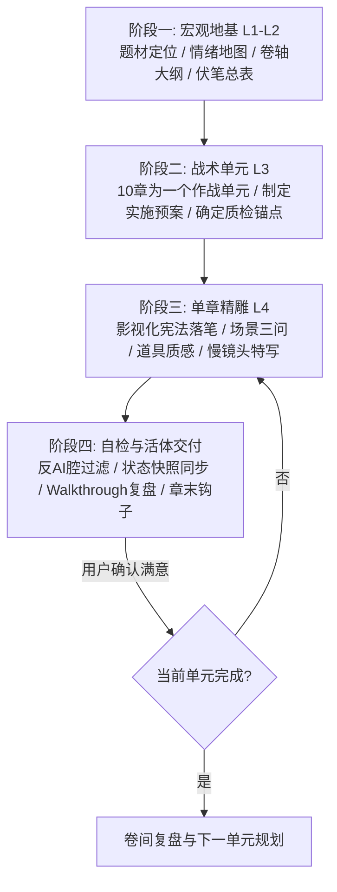

# 商业写作系统 | Hamuna Writing System

> **系统宣言**
> 好的商业小说不是词藻的堆叠，而是**精准的情绪操纵、严密的因果链条与沉浸的视听质感**。
> 本系统拒绝“快餐式批量灌水”，拒绝“失控黑盒跳步”，坚持**“大纲定调、预案先行、一章一磨、活体对账”**的专业创作者工作流。

---

## 核心工作流总览（The 4-Stage Production Pipeline）

---

## 阶段一：宏观地基（Macro Foundations）

在动笔写正文之前，必须建立四份基石文件（位于项目 `设定/` 目录下）：

1. **`00-情绪地图.md`（核心欲求与情绪曲线）**：
   - 确立核心驱动力：复仇、夺权、生存、证明、解密或救赎。
   - 标注全书三大情绪极值点（至暗时刻、惊天反转、最终绝顶）。
2. **`01-角色档案.md`（活体角色卡）**：
   - **首次定妆五要素**：体型轮廓、面部标志（一道疤/深眸/骨节）、服装触感与质地、手部特征（老茧/伤痕/扳指）、压迫气场。
   - **角色动机核**：绝不可动摇的核心欲望与绝不可触碰的逆鳞。
3. **`02-大纲.md`（四级骨架大纲）**：
   - 卷级划分（通常4-5卷），每卷明确：**战略目标**、**对标Boss阶梯**、**卷末核弹级大钩子**。
   - 梳理全书核心真相递进层级（五层真相剥茧法则）。
4. **`03-伏笔追踪表.md`（编号生命周期管理）**：
   - 所有重大悬念和线索严格编号（`#001` ~ `#NNN`）。
   - 状态追踪：【已埋设】->【推进/误导】->【回收兑现】。任何伏笔不得无故悬空。

> 🔴 **CHECKPOINT · 阶段一四份基石文件未全部就位前，禁止进入阶段二**——情绪地图缺位会让中段塌方，角色档案缺位会让群像脸谱化，大纲缺位会让伏笔无处落锚，伏笔表缺位会让收尾烂尾。

---

## 阶段二：战术单元预案（10-Chapter Tactical Unit）

为保证长篇连载的节奏密度，严禁一次性无序长跑，必须以 **10章为一个战术作战单元** 推进：

- **单元启动前**：输出一份《第XX-XX章单元实施预案》：
  - 本单元的破局核心任务与矛盾爆发点。
  - 10章逐章关键事件、情绪温差（冷/燃/虐/悬）、章末钩子。
  - 需推进或回收的伏笔编号清单。
- **用户确认**：由创作者/人类监督者确认预案方向无误后，再行进入逐章撰写。

> 🔴 **CHECKPOINT · 10 章预案未获用户书面确认前，禁止逐章动笔**——方向错则前 N 章全废，返工成本随章节数线性增长。

---

## 阶段三：单章影视化精雕（Chapter-by-Chapter Craftsmanship）

> 🔴 **CHECKPOINT · 单章动笔前必须先核三件事**：① 本章落在 10 章单元的哪一节；② 需推进 / 回收的伏笔编号清单；③ 角色当前活体状态（伤情 / 物资 / 环境印记）。

**单章撰写自检表（动笔前过一遍）**：
- [ ] 场景三问（光 / 空间 / 微环境）—— 缺哪项查 `references/cinematographic-constitution.md` 第一章
- [ ] 道具质感（材质 / 重量 / 损耗三选一）—— 缺哪项查第二章
- [ ] 动作慢镜头（受力形变 + 生理代偿）—— 缺哪项查第三章
- [ ] 情感物理化（物理行为 + 生理反应，禁用抽象情绪词）—— 缺哪项查第四章反面对照表

坚持**“一章一写，质量保证”**原则，单章正文字数通常保持在 **2200~3000字** 之间。每章撰写严格遵守《影视化写作宪法》：

### 1. 场景建立三问（Scene Triage）
每次场景转换或新开一幕，前3句内必须回答：
- **光从哪里来？**（冷暖、照射角、光斑穿透度、被阴影切割的明暗面）
- **空间尺度有多大？**（是狭窄窒息的密闭暗窟，还是回声浩渺的风沙峡谷）
- **空气微环境有什么？**（温差骤变、悬浮粉尘、血腥/土腥/焦木气味、耳边风声）

### 2. 重要道具质感（Prop Weight & Texture）
关键道具（兵刃、信物、令牌、文书、毒药）出场必须具备：
- **材质与重量感**：生铁的冷脆、玄铁的沉重、玉石的温润与断口晶体颗粒。
- **岁月战损痕迹**：磨损豁口、血锈斑驳、油脂包浆，拒绝全新塑料感。

### 3. 动作慢镜头切片（Micro-Action Choreography）
战斗、行刑、刺杀或高潮对峙，必须包含**帧级微动作描写**：
- 刀锋与骨骼/铠甲接触时的物理力道传导（震麻手腕、崩碎刃角）。
- 角色生理微反应（瞳孔骤缩、倒吸凉气、肌肉抽搐、后牙咬穿）。

### 4. 情感物理化表达（Physicalized Emotion）
- **严禁使用抽象情绪词**（禁止：“他极度愤怒/她伤心欲绝/内心十分震惊”）。
- **必须转化为物理距离与身体代偿**：两人的物理间距变化、手指攥紧指节发白、呼吸节律被打乱、下意识向后撤出防备身位。

---

## 阶段四：自检与状态对账（Quality Gates & State Sync）

单章正文完成后，必须在交付前执行**三道质量门（Quality Gates）**：

### 门禁1：反AI腔与词汇过滤器（Anti-AI Gate）
- [ ] **高频违禁副词清零**：全文扫描严查“极其、极度、宛如、简直、仿佛、赫然、不禁、不由得”。若出现，必须改用具象白描动词替换。
- [ ] **说明性总结清理**：禁止在文末使用“这不仅是……更是……”这类AI公文式概括。
- [ ] **视角连贯**：严禁无预兆上帝视角切换，牢牢锁定当前视点角色的感官半径。

### 门禁2：活体状态连续性检查（Continuity Gate）
- [ ] **伤情物理锁定**：检查上一章受过的伤（断骨、烧伤、失血）本章是否被遗忘或“神级自愈”。
- [ ] **资源对账**：随行人数、干粮、水袋、箭矢数量是否与上文闭环对齐。
- [ ] **环境印记**：身上的泥浆、血渍、破烂衣物是否随物理移动保持合理状态。

### 门禁3：章末钩子张力（Hook Gate）
- [ ] 结尾最后5行必须具备强张力（新敌人现身、致命倒计时、惊天秘密漏缝、生死抉择点），绝不平淡收场。

**三门禁修复路由（不达标时怎么修）**：
- 门禁 1（反 AI 腔）→ `references/anti-ai-lexicon.md` 同义词替换表
- 门禁 2（物理连续）→ `references/foreshadowing-tracker-spec.md` 状态快照回查
- 门禁 3（章末钩子）→ 重读角色动机核 + 伏笔追踪表找未兑现钩子

> 🔴 **CHECKPOINT · 三道质量门任一不达标，禁止交付**——必须按「不达标项 → 修哪类描写 → 复查哪门」三段式局部返工，不得绕过。

### 交付产物规范：
1. **正文文件**：存入 `正文/第XXX章-XXX(正式版).md`。
2. **复盘卡**：同步生成 `walkthrough_XXX.md`，向创作者汇报：
   - 核心剧情动作与反转点
   - 影视化高光镜头切片
   - 角色活体状态快照（伤情/物资更新）
   - 下章悬念钩子预告
3. **看板更新**：实时刷新 `task.md` 进度。

> 🔴 **CHECKPOINT · 卷间复盘前禁止开新单元**——情绪曲线、伏笔推进、角色状态、读者反馈（若有）全部对齐后才能锁定下一单元方向。

---

## 失败模式与边界 Fallback（Failure Modes & Fallback）

> 三段式：**触发条件 / 一线修复 / 仍失败兜底**。每一条只列**典型场景**，不替代 references/ 中的具体方法论。

| 触发条件 | 一线修复 | 仍失败兜底 |
|---|---|---|
| 用户拒绝填情绪地图 / 角色档案 / 大纲 | 退而求其次用 `references/genre-playbooks.md` 对应赛道默认模板，标 `[TODO:用户确认]` | 暂停动笔，等用户填齐（无底线的小说必然塌中段） |
| 10 章预案用户不批 / 反复修改 | 暂停动笔，把矛盾点列成「用户原始意见 vs 系统建议」对比表 | 用户三次否决同一方向后，触发「用户偏好高于系统方法论」白名单（见反例与黑名单 #7） |
| 三门自检不达标（反 AI 腔 / 物理连续 / 章末钩子） | 局部返工：定位不达标行号 → 套用 `references/cinematographic-constitution.md` 对应章节改写 | 整章返工超过 3 次仍不达标，触发「题材 / 设定与 skill 适配度」重审 |
| 伏笔闭环遗漏（已埋未收伏笔 ≥ 3 个进入收尾卷） | 列出未回收伏笔编号清单，请用户决定草草回收 / 延后到下一卷 / 砍掉 | 砍掉前必须用 scene 内一句话交代「此线索因故中断」，否则读者会认为是笔误 |
| 卷间复盘用户跳步 | 警告「跳过复盘后续一致性无法保证」，列出跳过的复盘点 | 用户坚持跳过，强制在下一卷开头加「时间跳跃提示」段落补回信息 |
| Skill 被误用于散文 / 诗歌 / 纪实 / 学术论文 | 礼貌拒绝，提示「本 skill 是商业小说 / 影视剧本专用引擎」，推荐通用写作工具 | — |
| 用户要求「一次写完 100 章」 | 拒绝并解释 10 章单元节奏约束（节奏崩塌 + 上下文窗口饱和 + 无法回溯） | 拆为多会话，每次只取最近 10 章 + 当前单元预案 + 当前活体状态 |
| 用户中途改卷轴战略 | 先冻结当前单元，逐章完成已开篇，回滚未开篇部分 | 战略变更涉及已开篇内容 → 必须重做情绪地图 + 全卷大纲 + 全伏笔表 |
| 反 AI 腔黑名单与用户偏好冲突 | 用户优先级最高，但提示「这会让交付质量下降到原生 AI 写作水平」 | 用户坚持 → 在交付文档开头标注「本章含用户偏好违禁词」便于追溯 |
| 单章字数偏离 2200~3000 字 | ±20% 内可接受（1760~3600），超此范围触发字数合理性自审 | 用户明确要求字数偏离 → 在 walkthrough 中注明「本章字数偏离标准原因」 |

---

## 反例与黑名单（Anti-Patterns & Don'ts）

> 与 references/ 内容**互补不重复**：references/ 写「应该怎么做」，本章写「一开始就不该做」。违反任一条，章节不达交付标准。

1. **不要跳过情绪地图直接动笔**——无核心欲求的小说中段必塌，情绪地图是后续所有决策的根。
2. **不要一次性灌水万字**——节奏必崩 + 上下文窗口饱和 + 无法回溯，10 章单元节奏是物理约束不是文学偏好。
3. **不要在用户未确认 10 章预案前直接写正文**——方向错则前 N 章全废，返工成本随章节数线性增长。
4. **不要删质量门省时间**——三门是物理连续性 + 沉浸感 + 留存率的保险，删任何一门交付即降级。
5. **不要用对话撑字数**——凑字对话读者一眼识破，台词密度过高的章节优先复核。
6. **不要把所有章节写成同一情绪色调**——情绪曲线必须有冷热交替，全程高燃 / 全程高虐都会让读者疲劳（参 `templates/00-emotion-map.md` 三大极值曲线）。
7. **不要把本 skill 用于商业小说 / 影视剧本之外的场景**——散文 / 诗歌 / 纪实 / 学术论文请用通用写作工具，本引擎的方法论不适用。
8. **不要替用户做作者主观判断**——「卷末钩子放反转还是悬念」「主角是否原谅反派」这类决定必须等用户输入，AI 不替创作者拍板。

---

## 附录与支撑资产（References & Templates）

- 完整影视化规范详见：`references/cinematographic-constitution.md`
- 反AI词汇与句式禁令详见：`references/anti-ai-lexicon.md`
- 伏笔与状态快照管理规范详见：`references/foreshadowing-tracker-spec.md`
- 各题材平台（男频/女频/短剧/悬疑）适配手册详见：`references/genre-playbooks.md`
- 全套开书脚手架模板详见：`templates/`
