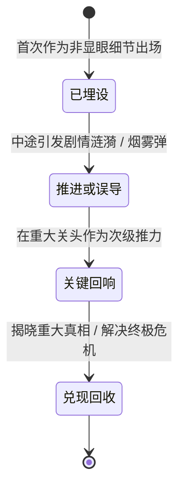

# 伏笔生命周期与活体状态追踪规范（Foreshadowing & State Tracking Spec）

> **系统定律**
> 长篇小说最致命的硬伤是**“前写后忘、机械降神、伤口瞬愈、伏笔悬空”**。
> 本规范提供了一套工程化的状态对账机制，确保 100~200 章体量的小说人物不失真、线索不烂尾。

---

## 一、伏笔编号系统（Foreshadowing Lifecycle #001~#NNN）

所有主支线重大线索、关键道具、身世隐喻、异常细节，自第一章起必须强制分配全局唯一编号：`#001`, `#002`, ...

### 伏笔四态生命周期模型



1. **【已埋设（Planted）】**：
   - 规则：必须作为合乎当时情境的自然细节出场，不可突兀高亮。
   - 例：`#001 左手腕旧疤`（第1章：女主下意识摩挲手腕旧疤，表面是冻疮，实为当年抄家火劫）。
2. **【推进或误导（Advanced / Misdirected）】**：
   - 规则：在后续章节中再次被提起，或被对手用来做伪证，加深悬念。
   - 例：`#001 左手腕旧疤`（第43章：男主在搏杀中扯下护腕，瞳孔骤缩，对身份产生致命怀疑）。
3. **【关键回响（Echoed）】**：
   - 规则：在危机时刻成为人物心理支撑或解谜线索。
4. **【兑现回收（Resolved）】**：
   - 规则：彻底引爆真相，闭环交付读者情绪价值。
   - 例：`#001 左手腕旧疤`（第195章：大殿昭雪，当众解开绷带作为正统沈家传人的铁证）。

> **生命周期铁律**：
> 任何埋下的伏笔，必须在 **50章以内** 有一次明确的“推进”或“回收”，严禁超过60章杳无音信（断头线）！

---

## 二、角色活体状态快照（Living State Snapshots）

每章开写前与交付后，必须对照检查三项“活体物理状态”：

### 1. 伤情物理锁定（The Injury Lock）
- **绝无瞬愈**：
  - 骨折：必须维持至少 20~30 章的物理限制（使用夹板、拐杖、骑马剧痛、无法发力）。
  - 烧伤/贯穿伤：必须经历感染发热、溃烂、切除死肉、结痂、牵拉裂开的完整生理病程。
  - 毒伤：必须伴随视力模糊、内力阻滞、手脚冰凉等持续代偿反应。
- **动作检验**：若主角上一章右臂粉碎性骨折，本章严禁出现“他双手稳稳端起长枪刺出”的失误。

### 2. 随身资源对账表（Resource Accounting）
- **消耗品必须有去向**：
  - 水囊：在沙漠行军中，每章喝几口、分给谁、战马消耗多少，必须有数字概念，不可无限取水。
  - 箭矢/暗器：射出一支少一支，战斗后若无“打扫战场捡回箭矢”的描写，箭囊必须清空。
  - 盘缠/金银：露白必然引来觊觎，消耗后必须有补给来源（剿匪、抢夺驿站、典当）。

### 3. 人际负债与心理存根（Emotional Ledger）
- 角色之间的好感度与仇恨值绝非开关量（开/关）。
- 经历了利用、背叛、救命之恩后，两人的物理间距、称谓变化、眼神落点必须持续演变，杜绝“上一章生死反目，下一章立刻谈笑风生”。

---

## 三、单元对账表模版（10章单元对账卡）

```markdown
### 单元状态快照（第 111-120 章对账）

| 项目 | 单元起始状态 | 单元终末状态 | 变化经过与章次 |
| :--- | :--- | :--- | :--- |
| **闻澈伤情** | 左腿骨折+高热未退 | 能够单腿独立发力，毒素已解 | 第115章攀岩再次渗血，第118章肩膀添袖箭伤 |
| **姜棠伤情** | 右手坏死组织已切除，神经麻木 | 熟练掌握单手断玉，创口结痂 | 第118章凭左手微操破解鲁班锁 |
| **骑兵编制** | 幽影铁骑 300 人 | 幽影 268 人 + 收编沙匪 1100 人 | 第115章峡谷战损32人，第116章斩首收编 |
| **伏笔进展** | #025真国宝（推进） | #025真国宝（已回收：玄铁虎符） | 第118章于地宫起获完整虎符 |
```
